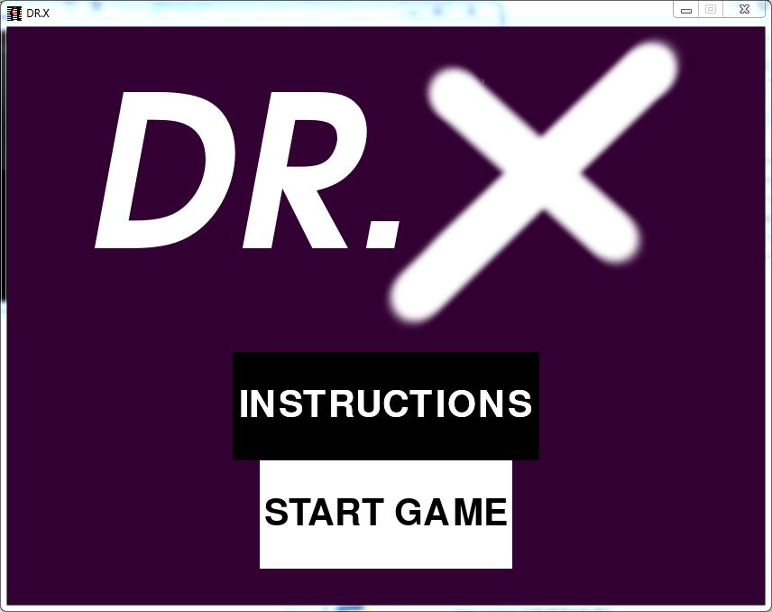
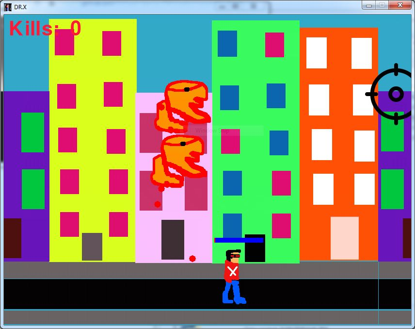

# DR.X
This is a simple game developed using pygame libraray.

This is developed for a contest (link:https://abibv.github.io/pyweek/)

-----------------------------------------------------------------------------------
# LIBRARIES REQUIRED:

* Pygame
* OS
* Random
* math
        
------------------------------------------------------------------------------------
# Commands

`pip3 install pygame`

Documentation and other stuff : www.pygame.org

--------------------------------------------------------------------------------------
# Some Images:

